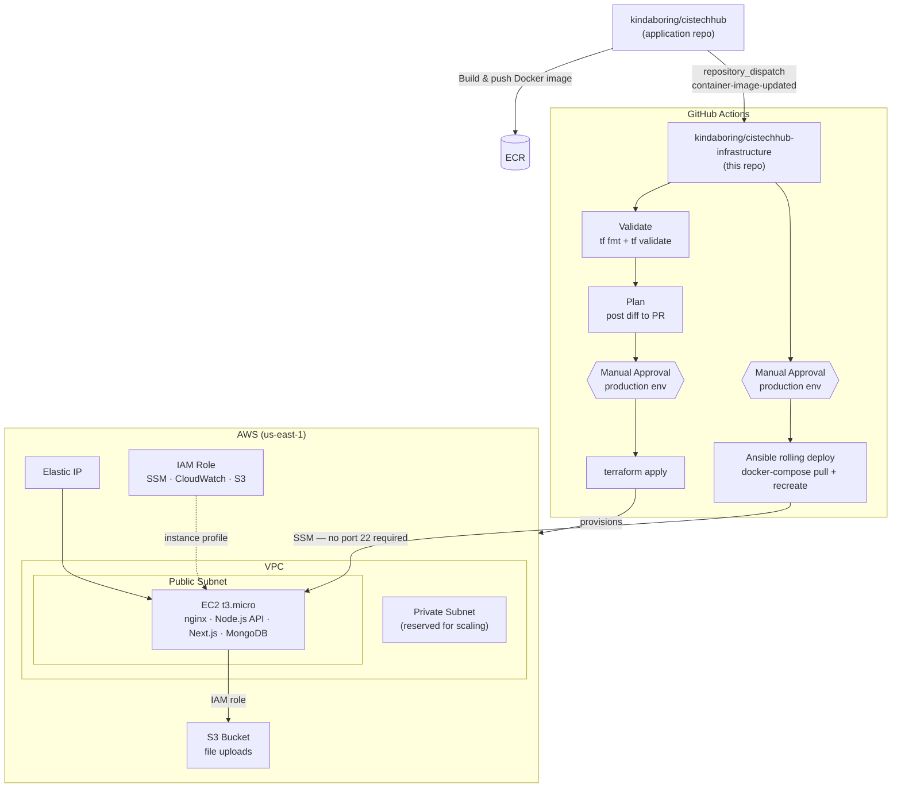

# CIS Tech Hub Infrastructure


Production-grade AWS infrastructure for the [CIS Tech Hub](https://github.com/kindaboring/cistechhub) web application, built to demonstrate end-to-end DevOps and cloud engineering practices. The infrastructure is fully automated — from provisioning to deployment — using Terraform, Ansible, and GitHub Actions.

## Architecture



## Tech Stack

| Layer | Technology |
|---|---|
| Infrastructure as Code | Terraform >= 1.9, AWS Provider ~> 5.0 |
| Configuration Management | Ansible, `amazon.aws` collection |
| CI/CD | GitHub Actions |
| Security Scanning | tfsec, Checkov (SARIF → GitHub Security tab) |
| Runtime | Docker, Docker Compose, Amazon Linux 2 |
| Cloud | AWS (EC2, VPC, S3, IAM, EIP, SSM) |

## Repository Structure

```
cistechhub-infrastructure/
├── .github/workflows/
│   ├── terraform.yml            # Validate → Plan → Apply pipeline
│   ├── ansible-lint.yml         # Playbook linting and syntax checks
│   ├── security-scan.yml        # tfsec + Checkov on every PR
│   └── deploy-on-image-push.yml # Cross-repo deploy trigger
│
├── environments/
│   └── cistechhub/              # Live environment config
│       ├── main.tf              # Module composition
│       ├── variables.tf
│       └── terraform.tfvars.example
│
└── modules/
    ├── networking/              # VPC, subnets, IGW, route tables
    ├── cistechhub-free-tier/    # EC2, security group, IAM, EIP, user-data
    ├── cistechhub-storage/      # S3 bucket with CORS
    ├── alb/                     # Application Load Balancer
    ├── database/                # RDS (reserved for scaling)
    ├── mongodb/                 # Self-hosted MongoDB on EC2
    ├── ecr/                     # Elastic Container Registry
    └── secrets/                 # AWS Secrets Manager
```

## CI/CD Pipeline

### Terraform Workflow (`terraform.yml`)

Triggered on every push and pull request that touches `environments/` or `modules/`.

```
PR opened                        Merge to main
    │                                 │
    ▼                                 ▼
Validate                          Validate
(fmt check, terraform validate)       │
    │                             Plan (requires AWS creds)
    ▼                                 │
Plan                              ┌───▼──────────────────┐
(posts full diff as PR comment)   │  Manual approval gate │
                                  │  (production env)     │
                                  └───┬──────────────────┘
                                      │
                                    Apply
```

### Cross-Repository Deployment (`deploy-on-image-push.yml`)

When the [application repository](https://github.com/kindaboring/cistechhub) builds and pushes a new Docker image, it fires a `repository_dispatch` event here. This triggers a rolling deploy via Ansible — no SSH keys required.

```
App repo: image push to ECR
         │
         └─► repository_dispatch (container-image-updated)
                      │
                      ▼
             Manual approval gate
                      │
                      ▼
             Ansible rolling deploy
             (docker-compose pull + force-recreate)
                      │
                      ▼
             Health check at /health
```

### Security Scanning (`security-scan.yml`)

Runs tfsec and Checkov on every PR and on a weekly schedule. Findings are uploaded to the GitHub Security tab as SARIF reports.

## Key Design Decisions

**SSM over SSH** — The EC2 instance has `AmazonSSMManagedInstanceCore` attached. All Ansible automation runs via the `community.aws.aws_ssm` connection plugin. No private keys are stored in GitHub secrets, port 22 does not need to be open, and access survives an instance recreation without any secret rotation.

**Manual approval gates** — The `terraform apply` and deployment jobs are gated behind a GitHub Environment (`production`) with required reviewers. Infrastructure changes never reach AWS without a human sign-off.

**Modular Terraform** — Each concern (networking, compute, storage, secrets) is an independent module. The `environments/cistechhub/` directory composes them, making it straightforward to add environments (staging, prod) by adding a new directory.

**Secrets never in state plain text** — MongoDB passwords and JWT secrets are generated by Terraform's `random_password` resource and marked `sensitive = true`. They are injected into the EC2 instance via user-data at launch time and never stored in the repo.

## Scaling Path

The current deployment runs all services on a single t3.micro to minimise cost. The repository is structured so that scaling to a production-grade multi-tier architecture requires no restructuring — only composition of the modules that already exist.

| What to scale | Module ready | What gets added |
|---|---|---|
| Separate compute from data | `modules/cistechhub-compute` | Dedicated EC2 for app, MongoDB moves to its own instance or Atlas |
| Managed database | `modules/database` | RDS instance in the private subnet replaces self-hosted MongoDB |
| Container registry | `modules/ecr` | ECR repository for image storage, removing the ECR dependency on the app repo |
| Load balancing + TLS | `modules/alb` | ALB in front of EC2, ACM certificate, HTTPS termination |
| Private networking | Subnet already provisioned | Add a NAT Gateway to give private-subnet resources outbound internet access |
| Multiple environments | New directory under `environments/` | Copy `environments/cistechhub/`, change `terraform.tfvars` — all modules are reused as-is |

The private subnet is already provisioned and associated with a route table — it has no NAT Gateway today because nothing runs in it. Adding one is a single module call. Similarly, moving from a single EC2 to an Auto Scaling Group behind the ALB would reuse the existing networking and security group resources without changes to the networking module.

## Cost Breakdown

This infrastructure is designed to run at near-zero cost within the AWS Free Tier and remain affordable beyond it.

### Active Resources

| Resource | Specification | Free Tier (Year 1) | After Free Tier |
|---|---|---|---|
| EC2 Instance | t3.micro (2 vCPU, 1 GB RAM) | 750 hrs/month free | ~$7.59/month |
| EBS Volume | gp3, 30 GB, encrypted | 30 GB/month free | ~$2.40/month |
| Elastic IP | Attached to running instance | Free | Free |
| S3 Bucket | Standard storage, AES-256 encrypted | 5 GB + 20K GET / 2K PUT free | ~$0.02/GB/month |
| VPC + IGW | Single VPC, public subnet | Always free | Always free |
| IAM + SSM | Roles, instance profiles, Session Manager | Always free | Always free |
| CloudWatch | Basic instance monitoring | Always free | Always free |
| HCP Terraform | Remote state backend | Free (≤ 500 resources) | Free (≤ 500 resources) |

### Estimated Monthly Cost

| Scenario | Cost |
|---|---|
| AWS Free Tier (first 12 months, new account) | **~$0/month** |
| After Free Tier (minimal S3 usage) | **~$11/month** |

### Cost-Conscious Design Choices

- **No NAT Gateway** — The private subnet is reserved for future scaling but no NAT Gateway is provisioned (would add ~$32/month).
- **No RDS** — MongoDB runs self-hosted on the EC2 instance instead of on a managed RDS instance (~$15–25/month saved).
- **No ALB** — An Application Load Balancer module exists for scaling but is not active in the current environment (~$16/month saved).
- **No ECR storage costs** — ECR images are managed in the application repository; this repo provisions no active ECR repositories.
- **S3 Lifecycle Policy** — Uploads are automatically expired after 90 days and incomplete multipart uploads are cleaned up after 7 days to prevent silent storage accumulation.
- **gp3 over gp2** — gp3 provides the same baseline performance as gp2 at a 20% lower cost per GB.

## Deploying

1. Copy `environments/cistechhub/terraform.tfvars.example` to `terraform.tfvars` and fill in your values.

2. Configure the required GitHub Actions secrets (see below).

3. Open a pull request — the pipeline will run `terraform plan` and post the diff as a comment.

4. Merge to `main` and approve the deployment in the GitHub Actions UI.

### Required GitHub Secrets

| Secret | Description |
|---|---|
| `TF_API_TOKEN` | HCP Terraform API token (for remote state backend) |
| `AWS_ROLE_ARN` | ARN of the IAM role GitHub Actions assumes via OIDC (e.g. `arn:aws:iam::123456789012:role/github-actions-cistechhub`) |
| `SSH_ALLOWED_CIDR` | Your IP in CIDR notation (e.g. `1.2.3.4/32`) — only needed if SSH ingress is enabled |
| `GOOGLE_CLIENT_ID` | Google OAuth client ID (optional) |
| `GOOGLE_CLIENT_SECRET` | Google OAuth client secret (optional) |
| `GOOGLE_REDIRECT_URI` | Google OAuth redirect URI (optional) |

### AWS OIDC Setup

No long-lived IAM access keys are stored in GitHub. Instead, GitHub Actions assumes an IAM role via OpenID Connect.

1. Create an IAM OIDC Identity Provider in AWS:
   - **Provider URL**: `https://token.actions.githubusercontent.com`
   - **Audience**: `sts.amazonaws.com`

2. Create an IAM role with the following trust policy (replace `<org>` and `<repo>`):

```json
{
  "Version": "2012-10-17",
  "Statement": [
    {
      "Effect": "Allow",
      "Principal": {
        "Federated": "arn:aws:iam::<account-id>:oidc-provider/token.actions.githubusercontent.com"
      },
      "Action": "sts:AssumeRoleWithWebIdentity",
      "Condition": {
        "StringEquals": {
          "token.actions.githubusercontent.com:aud": "sts.amazonaws.com"
        },
        "StringLike": {
          "token.actions.githubusercontent.com:sub": "repo:<org>/<repo>:*"
        }
      }
    }
  ]
}
```

3. Attach the necessary IAM policies to the role (EC2, VPC, S3, IAM, SSM) and save the role ARN as the `AWS_ROLE_ARN` secret.

### Required GitHub Environments

Create two environments under **Settings → Environments**:

- `plan` — no restrictions
- `production` — add yourself as a required reviewer

## Local Usage

```bash
cd environments/cistechhub

# Initialize
terraform init

# Preview changes
terraform plan

# Deploy
terraform apply

# Tear down
terraform destroy
```

```bash
cd ansible

# Health check
ansible-playbook playbooks/monitoring.yml -i inventory/aws_ec2.yml

# Rolling deploy
ansible-playbook playbooks/update-application.yml -i inventory/aws_ec2.yml

# Backup MongoDB
ansible-playbook playbooks/backup-mongodb.yml -i inventory/aws_ec2.yml
```